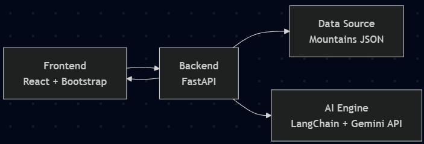

# **🏔️ Mountain Explorer**

## **Mountain Explorer Web App**

This app allows users to explore mountains and discover fascinating facts about them. Users can also generate unique, AI-powered insights about any mountain with the click of the "Generate AI Facts" button.

## 🎥 Video Demo

A quick demonstration of the Mountain Explorer web application in action. Click the image below to watch the video on YouTube. 

[](https://youtu.be/s2Xd5Om3wtA?si=L7mVtCb6t2dhGeLK)

## **🏛️ Overview & Architecture**

This application uses a modern, decoupled three-tier architecture, integrating a smart client (frontend), a robust API (backend), and external AI services for dynamic content generation. 

### **Architecture Diagram**



### **Component Roles**
- **Frontend (React & Bootstrap)**: A responsive user interface built with React that handles user interaction. It fetches data from the backend and displays the mountain directory, filters, and detailed modal views.
- **Backend (FastAPI)**: A Python-based API that serves mountain data from a JSON file, provides local image files, and orchestrates calls to the AI services for generating dynamic facts. 
- **AI Engine (LangChain & Gemini)**: The "brain" of the application. It uses LangChain agent to process user prompts, gather information from tools like Tavily and Wikipedia, and uses Google's Gemini model to generate new, interesting facts about the mountains. 

## **📁 Project Structure**

This repository contains both the frontend and backend system built with: 

- **React** for frontend framework
- **Bootstrap** for styling
- **FastAPI** for the web API
- **LangChain & Gemini** for AI-powered fact generation

## **🚀 Getting Started**
#### Follow these steps to set up the project.

## **I. 🔗 Clone the Repository**

```bash
git clone https://github.com/Naqo08/mountain-explorer.git
cd mountain-explorer
```

## **II. 🐍 Backend Setup (FastAPI)**

### **A. Set Up Virtual Environment**

1. **Navigate to the backend folder**
  - Open your preferred terminal and from the project's root directory, run: 
  `cd backend`
  - Now your current directory will look like:  

    `./mountain-explorer/backend`

2. **Create the virtual environment**
  - Run the following command. This creates a .venv folder in your backend directory

    ```bash
    # For Windows
    python -m venv .venv
    
    # For macOS/Linux
    python3 -m venv .venv
    ```

3. **Activate the Virtual Environment**
  - *Windows*
    ```bash
    # For Git Bash
    source .venv/Scripts/activate

    # For Command Prompt
    .\venv\Scripts\activate
    ```

  - *macOS/Linux*
    ```bash
    source .venv/bin/activate
    ```

### **B. Install Dependencies & Run**

1. **Install Dependencies**
  - With your virtual environment active, install all required packages from the requirements.txt file.

    ```bash
    pip install -r requirements.txt
    ```
2. **Set Up Environment Variables**
  - In the `backend` directory, create a new file named `.env`.
  - Add your API keys to this file. This is crucial for the AI features to work. 
    - **Google Gemini API Key**: Get your key from [Google AI Studio](https://aistudio.google.com/app/apikey).
    - **Tavily API Key**: Get your key from the [Tavily Homepage](https://app.tavily.com/home).

    ```bash
    GEMINI_API_KEY="your_google_api_key_here"
    TAVILY_API_KEY="your_tavily_api_key_here"
    ```

3. **Run the FastAPI Server**
  - From the `backend` directory, run the development server with: 

    ```bash
    uvicorn main:app --reload
    ```
  - Once the server is running, you can access it at: 
    - API Root: `http://127.0.0.1:8000`
    - API Docs (Swagger UI) `http://127.0.0.1:8000/docs`


## **III. 💻 Frontend Setup (React)**

### **A. Install Node.js**

1. **Download Node.js**
  - If you don't have Node.js installed, download the LTS (Long-Term Support) version from the [official Node.js website](https://nodejs.org/en)
2. **Verify Installation**
  - Open a new terminal and run the following commands to ensure Node.js and npm are installed correctly.: 

    ```bash
    node --version
    npm --version
    ```

### **B. Install Dependencies & Run**

1. **Navigate to the frontend folder**
  - From the project's root directory, run: 

    ```bash
    cd frontend
    ```

2. **Install Dependencies**
  - This command will download all the necessary React packages defined in `package.json`.

    ```bash
    npm install
    ```
3. **Run the React Development Server**
  - Start the frontend application with: 

    ```bash
    npm run dev
    ```
  - Your browser should automatically open to `http://localhost:5173` (or a similar port), where you can see the Mountain Explorer app running.

## **💡 Future Improvements & Expansions**

This project provides a solid foundation that can be extended with many exciting features. Here are a few ideas for future development:

- **Advanced Data Visualization**: Add a "Comparison Mode" where users can select multiple mountains and see a side-by-side visual comparison of their heights, prominences, and other stats using charts.

- **Real-Time Data Integration**:

  - **Summit Weather**: Integrate a weather API (like OpenWeatherMap) to display current weather conditions and a forecast for the mountain's summit.

- **User-Generated Content**:

  - **Photo Galleries**: Allow users to create accounts and upload their own photos from their climbs.

  - **Reviews & Difficulty Ratings**: Implement a user-based rating system for climbing difficulty, trail conditions, and overall experience.

- **Detailed Hiking & Climbing Routes**: For each mountain, add detailed information about popular hiking and climbing routes, including route maps, distance, elevation gain, and estimated time to complete.
